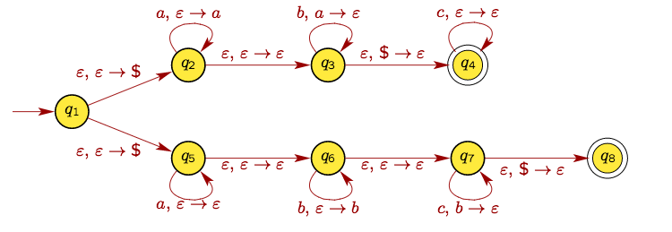

PDA for L = (a^i b^j c^k), i = j or j = k
==

We will use non-deterministic PDA to solve this question,
The PDA will have two non-deterministic branches:

## Branch 1 (for i = j)
  * (q0, e, $) |- (q1, $)
  * (q1, a, $) |- (q1, a)
  * (q1, a, a) |- (q1, aa)
  * (q1, b, a) |- (q1, ^)
  * (q1, c, $) |- (qf, $)
  * (qf, $, $) |- (qf, $)

## Branch 2 (for j = k)
  * (q0, e, $) |- (q2, $)
  * (q2, a, $) |- (q2, $)
  * (q2, b, $) |- (q2, b)
  * (q2, b, b) |- (q2, bb)
  * (q2, c, b) |- (q2, ^)
  * (q2, $, $) |- (qf, $)
